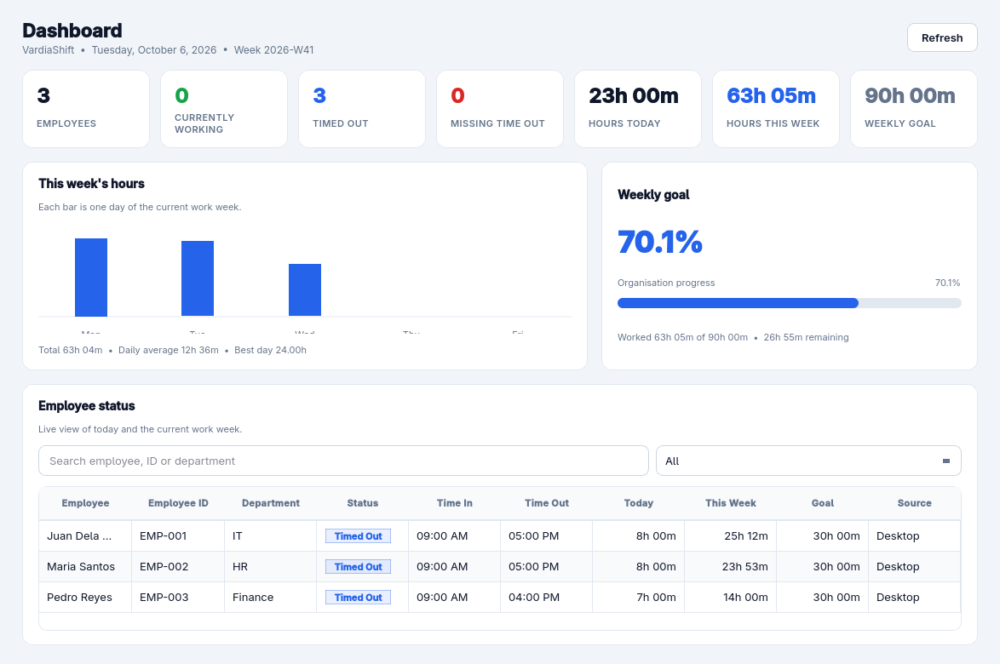
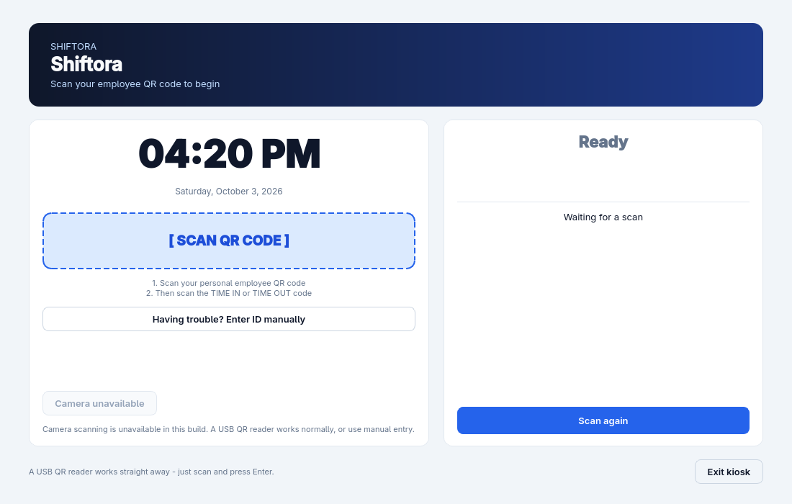
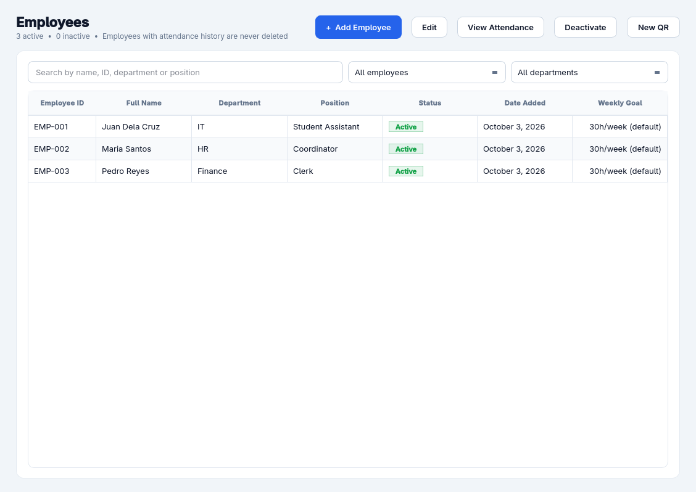

<div align="center">

# VardiaShift

**Standalone desktop employee time-in / time-out & attendance management**

No servers. No cloud. No Python required to use it.

Download it, open it, scan QR codes, track hours.

[](https://github.com/YourGuyBored/VardiaShift/actions/workflows/tests.yml)
[](https://github.com/YourGuyBored/VardiaShift/releases/latest)




</div>

---

## What is VardiaShift?

VardiaShift is a **standalone desktop application** for small teams and offices
that need simple, reliable attendance tracking:

* Employees scan a **personal QR code**, then a **TIME IN** / **TIME OUT** code.
* The app records exact arrival/departure times and computes hours worked.
* Administrators see who is working, weekly progress against an hour goal,
  attendance history, reports, and backups - all offline.

Everything is stored in a local **SQLite** database that the app creates and
manages itself. There is nothing to install, configure, or host.

---

## Download (normal users start here)

You do **not** need Python or any technical setup.

### Windows - the installer (recommended)

1. Go to **[github.com/YourGuyBored/VardiaShift/releases/latest](https://github.com/YourGuyBored/VardiaShift/releases/latest)**.
   That page always shows the newest version, so a bookmarked link keeps
   working after future releases.
2. Download **`VardiaShift-Setup-Windows-x64.exe`**.
3. Double-click it and follow the installer.

The installer adds a Start Menu entry, offers a desktop shortcut
(tick the box on step 3), and includes a proper uninstaller under
**Settings → Apps → Installed apps**. The app itself is a single folder, so
removing it never touches your attendance data.

> **Windows may show a blue "Windows protected your PC" screen.** VardiaShift is
> not code-signed, which costs a few dollars a year and requires a real
> business address. Choose **More info → Run anyway**. The app is open source
> and you can read every line of it in this repository.

### Portable builds (no installer)

On the same releases page you will also find:

| File | Use it on | How to run |
|---|---|---|
| `VardiaShift-Windows-x64.zip` | Windows | Extract, then double-click **`VardiaShift.exe`** |
| `VardiaShift-Linux-x64.tar.gz` | Linux | Extract, then run **`VardiaShift`** |

Nothing is written into the folder you extract to, so you can delete it to
"uninstall".

### From source (developers, or if a build will not run)

Download **Source code (zip)** from the code menu on the GitHub page, extract
it, then on Windows double-click **`setup_windows.bat`** - it creates the
virtual environment, installs everything, and puts a desktop shortcut in
place. On Linux or macOS:

```bash
python3 -m venv .venv && source .venv/bin/activate
pip install -r requirements.txt
python run.py
```

In every case the app starts and creates its own data folder automatically.

> Your data lives in a per-user folder, never next to the executable:
> `%LOCALAPPDATA%\VardiaShift` on Windows,
> `~/Library/Application Support/VardiaShift` on macOS,
> `~/.local/share/VardiaShift` on Linux.

---

## First launch

The very first time VardiaShift opens, it detects that no database exists,
creates one, and shows the **first-time setup** screen:

```text
================================
      VARDIASHIFT
================================

        FIRST-TIME SETUP

Create Administrator Account

Username
[________________]

Password (min. 8 characters)
[________________]

Confirm Password
[________________]

What kind of organisation is this?
[ School                     v ]

How do people clock in?
[ Quick - one scan is enough  v ]

        [ CREATE ACCOUNT ]
```

Two questions come with the account. **Organisation type** sets the work week,
the weekly goal and the shift times for a School, Small office or Shop.
**How people clock in** picks between Quick, where one scan records the arrival,
and Strict, where each employee's own QR is scanned before the shared TIME IN or
TIME OUT code. Both are ordinary settings, changeable later in Settings.

After creating the account you land on the **dashboard**. You will sign in
with this account on every later launch.

Passwords are stored only as salted **PBKDF2-SHA256** hashes - never in plain
text. After several wrong attempts sign-in locks briefly, and an idle session
signs itself out (configurable in Settings).

With no employees the dashboard offers **Load sample data**: three demo
employees and a week of attendance, so the app can be looked at before any real
data is entered. **Remove sample data**, on the same page, deletes them and
their attendance in one click. Sample employees use a `sample-` ID prefix, so
removal cannot touch a real employee.

---

## Adding employees

Open **Employees** → **Add Employee** and fill in:

| Field          | Example              |
|----------------|----------------------|
| Employee ID    | `EMP-001` (suggested automatically) |
| Full Name      | Juan Dela Cruz       |
| Department     | IT                   |
| Position       | Student Assistant    |
| Custom code    | Optional, e.g. badge `4242` |
| Weekly goal    | Organisation default, or e.g. 20 hours |

The **custom code** is a human-typable identifier (badge number, short code,
nickname - no length limit, almost anything goes except control characters).
Employees can type it instead of scanning when a reader is unavailable, it is
searchable, and it is printed on their QR card. It never replaces the secure
QR token inside the code itself, which stays a fixed random value so old
printouts keep working exactly as before.

Employees are listed with their status (**Active** / **Inactive**), date added
and weekly goal. You can **edit**, **deactivate/reactivate**, and search them.

Employees with attendance history are **never permanently deleted** -
deactivate them instead, so the records stay intact.

### Adding many employees at once

**Employees** → **Sample file** saves a CSV you can fill in. Add one row per
person, then **Import from file**. Pick the CSV or an XLSX and a preview shows
every row first: how many are new, how many update an existing employee, how many
are skipped, and every error. Nothing is saved until you confirm, and a file with
any error row cannot be confirmed until the errors are fixed.

Columns are `Employee ID`, `Full Name`, `Department`, `Position` and
`Custom Code`. An ID repeated inside one file is skipped. A custom code that
already belongs to a different employee is reported as an error rather than being
reassigned.

---

## QR setup

Open the **QR Codes** page. There are three kinds of code:

1. **Employee QR** - one personal code per employee. Print one card for each
   person (single, or all at once). Each card carries only a random token,
   never a name or ID number.
2. **TIME IN QR** - the public code posted at the entrance for arrivals.
3. **TIME OUT QR** - the public code posted at the entrance for departures.

For each code you can **generate**, **preview**, **download as PNG** and
**print** a labelled sheet. If a card is lost or you suspect misuse, press
**Regenerate** - the old code stops working immediately and the change is
written to the audit log.

### Why two scans?

The public TIME IN / TIME OUT codes carry **no employee information**, so
nobody can clock in on someone else's behalf. Attendance is only recorded
when the employee's *own* QR is scanned first:

```text
Employee QR  +  TIME IN QR   =  Time In recorded
Employee QR  +  TIME OUT QR  =  Time Out recorded
```

---

## Employee usage (the kiosk)

Open the **Attendance Kiosk** from the sidebar. It is a deliberately simple
screen with a live clock:

```text
================================

       COMPANY ATTENDANCE

             09:02 AM
        October 3, 2026

       [ SCAN QR CODE ]

   Scan your employee QR code

================================
```

The kiosk fills the screen by default so it reads well from a distance. It
stays a normal window you can drag, resize and minimize, and **F11** toggles
fullscreen either way. If you would rather it always open as a movable
window, turn off *Kiosk fullscreen* in Settings → Attendance Kiosk - the
setting is honoured, and the window keeps its size and position between
sessions.

Leaving the kiosk requires the administrator password (Exit kiosk button
or the window close button) - employees cannot reach the admin screens from
it. Quitting VardiaShift itself always works without a password.

**Single-scan mode (optional):** enable *Single-scan clocking* in
Settings → Attendance and one employee scan is enough - VardiaShift records
time-in when the employee is not working, and time-out when they are.

**Arriving:**

1. Scan your personal employee QR.
2. The kiosk greets you by name.
3. Scan the **TIME IN** code (skipped entirely in single-scan mode).

```text
TIME IN SUCCESSFUL

Juan Dela Cruz

09:02 AM
October 3, 2026

Have a productive day!
```

**Leaving:**

1. Scan your personal employee QR.
2. Scan the **TIME OUT** code.

```text
TIME OUT SUCCESSFUL

Juan Dela Cruz

05:14 PM

Today's Work Time
8h 12m
```

Mistakes are explained in plain language (`Already Timed In`, `Not Timed In`,
`Duplicate Scan Ignored`, ...).



### Scanning hardware

* **Webcam** - the kiosk decodes the camera feed directly (needs the optional
  `opencv-python` package in a from-source install; release builds document
  whether it is included).
* **USB QR reader** - any keyboard-style scanner just works: scan, press
  Enter, done. No drivers or configuration.
* **Manual entry** - an employee ID can be typed when a scanner is unavailable
  (can be disabled in Settings → Attendance; manual entries are labelled and
  audited).

---

## Phone clock-in / clock-out (same Wi-Fi, no internet needed)

Employees can also clock in and out from their phone browser - nothing to
install, no accounts, no typing:

1. In VardiaShift, open **Settings → Phone Attendance**, tick
   *Enable phone attendance*, save, and press **Start service**. The panel
   shows the exact base address for phones.
2. On the **QR Codes** page, select an employee and press
   **Phone clock-in / out QR**. Print it or show it on screen.
3. The employee joins the **same Wi-Fi** as the VardiaShift computer and points
   their phone camera at the code. The QR holds a full web address, so the
   page opens by itself in the browser - no typing, no tapping a link.
4. Their personal page shows whether they are currently clocked in and offers
   two buttons: **Time in** (blue) and **Time out** (red). They tap the one
   they mean. The result is shown immediately, including hours worked after
   time-out.

Both buttons are always shown, so an employee never has to guess. Each works
only once per page load, and pressing the wrong one is refused with a plain
message rather than recording the opposite action - VardiaShift still enforces
one session per day, so a second time-in or a time-out with no open session
is rejected either way.

The service only runs while enabled and only listens on this computer's own
networks (no UPnP, no port forwarding, no cloud). Turning the feature off in
Settings stops a running service immediately.

Details worth knowing:

* The QR encodes this computer's LAN address, so it only works while the
  VardiaShift computer is on the same network. If the address changes (a
  different Wi-Fi, or a DHCP renewal) the printed code stops working and
  needs reprinting - the status panel in Settings shows the current address.
* Printing a phone QR needs a network address. If the computer is not on a
  network yet, VardiaShift says so instead of printing a code that would scan
  fine and then open nothing.
* The link carries the same revocable token as the employee QR - regenerating
  the employee QR invalidates old phone links too.
* Each button tap uses its own one-time code, so double-taps and replays
  record nothing twice. Pressing one button does not spend the other's code.
  Simultaneous requests from kiosk and phone cannot create duplicate rows
  either.
* Phone records appear as **Phone** in the dashboard, attendance views and
  reports, alongside Desktop and Admin-correction entries.
* If the service won't start, the port is probably busy - change
  *Phone service port* (default `8123`) and make sure the computer's
  firewall allows it on private networks. The status panel shows the exact
  address phones should open.

## Administrator workflow

**Dashboard** - who is working right now, who timed out, who is missing a
time-out, today's hours, this week's hours vs the organisation goal, and a
live per-employee table with search and status filters.



**Employee details** - pick an employee to see weekly progress
(`24h 35m / 30h`, remaining, overtime, progress bar), a day-by-day breakdown,
and complete history with Today / This week / Last week / This month /
Custom-range filters.

**Corrections** - forgot to scan out? Add or fix times with a required reason.
The original values stay in the **audit log** with your username, old value,
new value and reason. Nothing is ever silently overwritten.

**Reports** - daily, weekly, monthly and custom-range reports, optionally per
employee, exported as **CSV** (always), **XLSX**, or sent straight to
**Google Sheets** (see below).

**Report templates** - a template decides which columns an export has, in what
order, what each is called, how wide it is, and whether a duration is written as
text (`8h 12m`) or as a number (`8.23`) so a spreadsheet can total it. Pick one
from the dropdown on the Reports page; **Edit template** changes the columns and
**Duplicate** makes a copy to adjust. CSV, XLSX and Google Sheets all use the
same template, so the three exports of one report match. Six templates ship
built in, including a payroll sheet and a compact variant.

**Importing a spreadsheet** - **Reports** → **Import from file** reads a CSV or
XLSX back in using the same template, so a report exported from VardiaShift can
be edited in Excel and imported again. A preview counts new, changed, skipped
and error rows and lists the detail for each. Nothing is written until you
confirm, and a file with any error row cannot be confirmed. Every change is
audit-logged with the reason *Imported from spreadsheet*.

**Settings** - organisation name, time zone, date/time formats, default
weekly goal (20/25/30/35/40 presets), work-week days, shift times, daily cap,
overtime tracking, kiosk behaviour and auto sign-out on the main tabs. The four
settings that rarely need changing - grace period, duplicate-scan window, audit
log retention and phone port - are on an **Advanced** tab. Everything persists
in the database.

**Backup & Restore** - one-click timestamped backups
(`backup_2026-10-03_21-30-00.db`), a backup list, restore from the list or
from a file, automatic verification before restoring, and an automatic safety
copy of the current database first. Restoring signs you out so you sign back
in against the restored data.

---

## Google Sheets export (optional)

Any report can be uploaded as a new tab into a Google spreadsheet, so
attendance data sits next to anything else you track there. This is fully
optional: without it VardiaShift works exactly as before, offline.

One-time setup (about five minutes, needs internet once):

1. Nothing to install: the Sheets libraries ship inside VardiaShift
   (desktop and packaged builds alike).
2. In [Google Cloud Console](https://console.cloud.google.com/), create a
   project, enable the **Google Sheets API**, then create a **service
   account** (IAM & Admin → Service Accounts) and download its **JSON key**.
3. Open your spreadsheet and **Share** it with the service account's email
   address (Editor role). The address is inside the JSON file as
   `client_email`.
4. In VardiaShift: **Settings → Google Sheets** → *Choose service account
   file…*, pick the JSON key, tick *Enable Google Sheets export*, paste the
   **Spreadsheet ID** (the long part of the sheet URL between `/d/` and
   `/edit`), and save.
5. On the **Reports** page, generate any report and press **Send to Google
   Sheets**. Each upload creates a timestamped tab — existing tabs are never
   overwritten.

The key file is validated before it is stored, lives only in your local data
folder, and is never logged. Uploads reuse the same formula-safe cell
handling as the CSV/XLSX exports.

> **Treat that JSON key like a password.** Anyone holding it can edit any
> spreadsheet it has been shared with. Keep it out of version control
> (`.gitignore` already blocks it) and delete your downloaded copy once
> VardiaShift has imported it - you can always issue a new key from Cloud.

---

## Developer installation

```bash
git clone https://github.com/YourGuyBored/VardiaShift.git
cd VardiaShift
python -m venv .venv
# Windows: .venv\Scripts\activate | Linux/macOS: source .venv/bin/activate
pip install -r requirements-dev.txt
python run.py
```

Optional extras:

```bash
pip install -r requirements-optional.txt   # webcam scanning (Google Sheets ships built-in)
```

Run the test suite:

```bash
python -m pytest tests/ -q
```

Headless environments (CI, servers) work out of the box - the suite defaults
to Qt's offscreen platform. To *watch* the GUI tests on a machine with a
display:

```bash
QT_QPA_PLATFORM=xcb python -m pytest tests/test_ui.py
```

---

## Build (create the downloadable executable)

**Windows** (on a Windows machine) - double-click or run:

```bat
build_windows.bat
```

**Linux**:

```bash
./build_linux.sh
```

Or directly:

```bash
pip install -r requirements.txt pyinstaller
pyinstaller --noconfirm VardiaShift.spec
```

The distributable appears under `dist/`:

```text
GitHub
   ↓  Releases
VardiaShift-Windows-x64.zip
   ↓  Download & Extract
VardiaShift.exe
   ↓  Run (no Python needed)
```

Tagged pushes (`v*`) automatically build the packages, compile the Windows
installer (`installer/windows/VardiaShift.iss`), and publish a GitHub release
with `VardiaShift-Setup-Windows-x64.exe` plus the portable archives, via
`.github/workflows/release.yml`. Every push also runs the full test suite on
Windows and Linux via `.github/workflows/tests.yml`.

---

## Project structure

```text
VardiaShift/
├── app/
│   ├── main.py               # entry point, setup→login→main state machine
│   ├── context.py            # composition root (database, services, QR, phone)
│   ├── constants.py
│   ├── database/             # SQLite connection, migrations, repositories
│   ├── models/               # admin, employee, attendance, settings, QR, audit
│   ├── services/             # auth, employees, attendance, reports, backup, QR, settings
│   ├── phone/                # local-network clock-in/out service (stdlib HTTP)
│   ├── qr/                   # payload format, QR/card image generation, scanner widget
│   ├── ui/                   # setup, login, dashboard, employees, attendance,
│   │                         # kiosk, QR management, reports, settings, admin
│   └── utils/                # app-data paths, time utils, validation
├── tests/                    # pytest suite
├── installer/windows/        # Inno Setup installer script
├── assets/                   # application icon and README screenshots
├── data/                     # placeholder (runtime data lives in the OS data dir)
├── run.py                    # `python run.py` launcher
├── setup_windows.bat         # double-click install from source (Windows)
├── VardiaShift.spec          # PyInstaller specification
├── build_windows.bat / build_linux.sh
├── requirements*.txt / pyproject.toml
└── README.md / CHANGELOG.md / LICENSE
```

The service layer never touches Qt and the UI never touches SQL directly, so
a future cloud-sync feature can be added at the `ApplicationContext` level
without rewriting screens or queries.

---

## Security

* PBKDF2-HMAC-SHA256 password hashing (390 000 iterations), per-password salt.
* QR payloads contain only opaque random tokens - no names, IDs or personal
  data. Tokens are revocable individually.
* Phone check-in links use the same tokens, need a single-use code per tap,
  answer unknown links with an identical generic page, and throttle repeated
  failures per address.
* Exported CSV/XLSX cells starting with `=`, `+`, `-` or `@` are neutralised
  so spreadsheet apps never evaluate employee-entered text as formulas.
* Parameterised SQL everywhere; destructive restores always take a safety copy.
* Admin-only configuration, session handling with auto sign-out.
* Full audit log for sign-ins, employee changes, corrections, QR rotations,
  settings, backups and restores.

---

## Offline-first

After installation VardiaShift works with **no internet connection**. The only
things that need the network are downloading the app itself and (optionally)
receiving updates.

---

## License

MIT - see [LICENSE](LICENSE).
